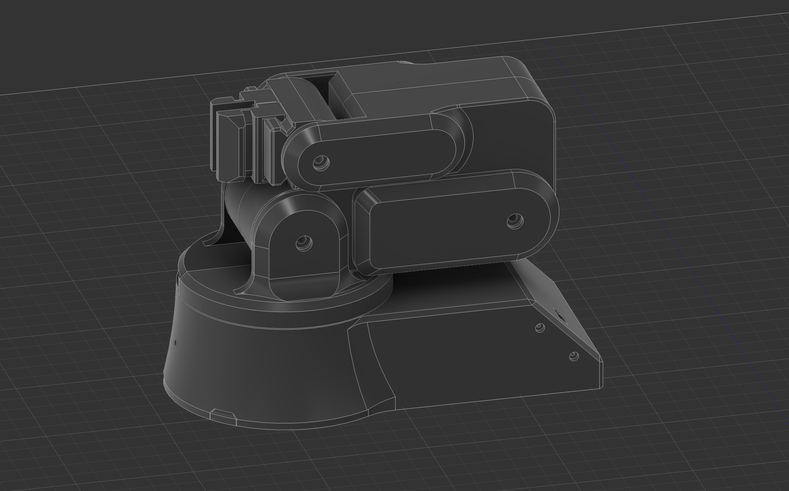
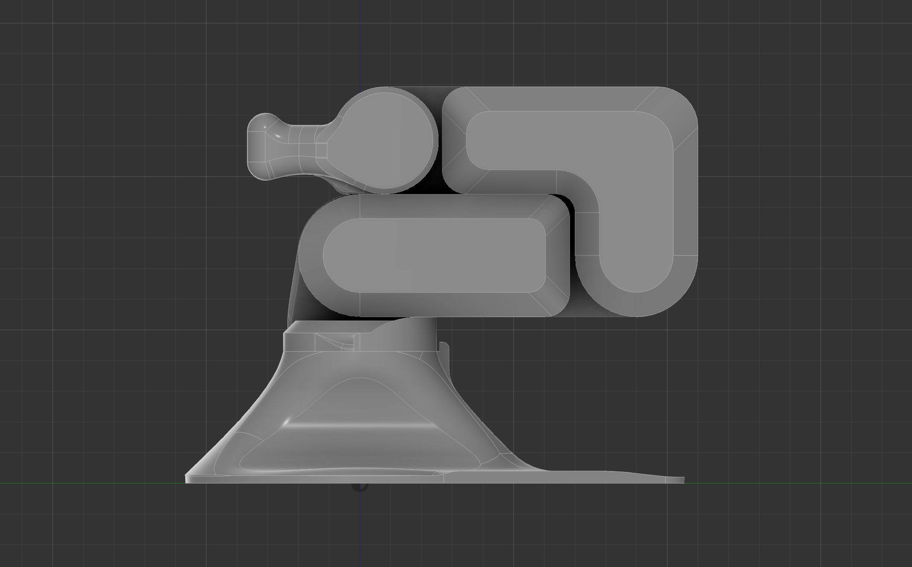

<table width="100%">
  <tr>
    <td width="50%">
      
    </td>
    <td width="50%">
      
    </td>
  </tr>
</table>


# Mino Arm

Mino is a robot arm project built from accessible components. It is designed to be simple to assemble, easy to understand, and practical for learning robotics. The project includes two items:

- **Mino**: the main arm, powered by servos and controlled through an Arduino board.
- **Mini Mino**: a scaled-down version of the arm that acts as the controller. By moving Mini Mino, the larger arm follows the same motion.

This setup creates a direct way to control the robot arm without complex controllers.

---

## Some Features:

- A full-sized robot arm (Mino) that can perform basic movements.
- A smaller replica (Mini Mino) that serves as the input device.
- Motion mirroring: Mini Mino’s movements are replicated by Mino.
- Built with affordable and widely available parts such as servos, Arduino UNO, potentiometers, and jumper wires.
- Expandable design that allows adding new functions like gripping or rotation.

---

## Repository Structure
```
Mino/
├── 3d-parts-to-edit/
│   └── contains all the 3d files to edit and customize mino
├── 3d-parts-to-print/
│   └── contains all the 3d files to print and make your own mino
├── img/
│   └── contains all the images
├── MinoCode.ino/
│   └── contains code
├── README.md
└── bom.csv
```

---

## Hardware Used:

- 20KG torque servos for the main arm
- SG90 micro servos for Mini Mino
- PCA9685 servo driver board
- Arduino UNO
- Potentiometers and push buttons
- Jumper wires and connectors
- Screws and 3D printed parts

---

## How It Works:

- Mini Mino captures joint angles using servos and potentiometers.
- Arduino UNO processes the signals and sends commands.
- Mino’s servos replicate the same motion at full scale.

This creates a control system where the smaller arm acts as the controller for the larger one.

---

## New things that can be added:

- Adding wireless communication between Mini Mino and Mino
- Improve grip strength and payload capacity
- Explore AI-assisted motion planning

---

<p align="center">This project was made possible by <a href="https://blueprint.hackclub.com">hackclub</a> ❤️</p>

